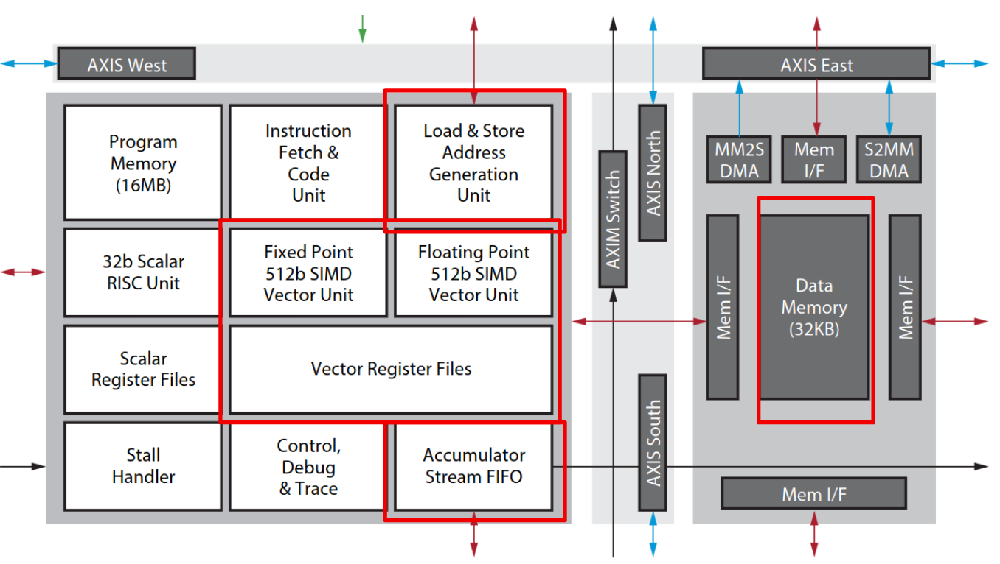
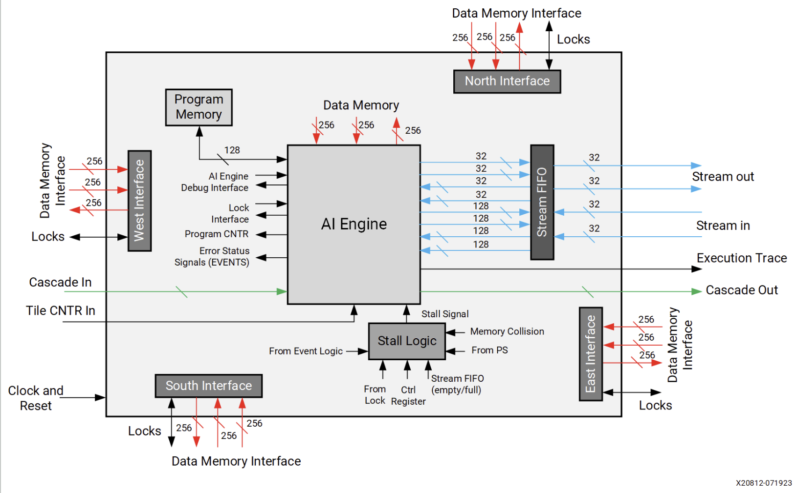
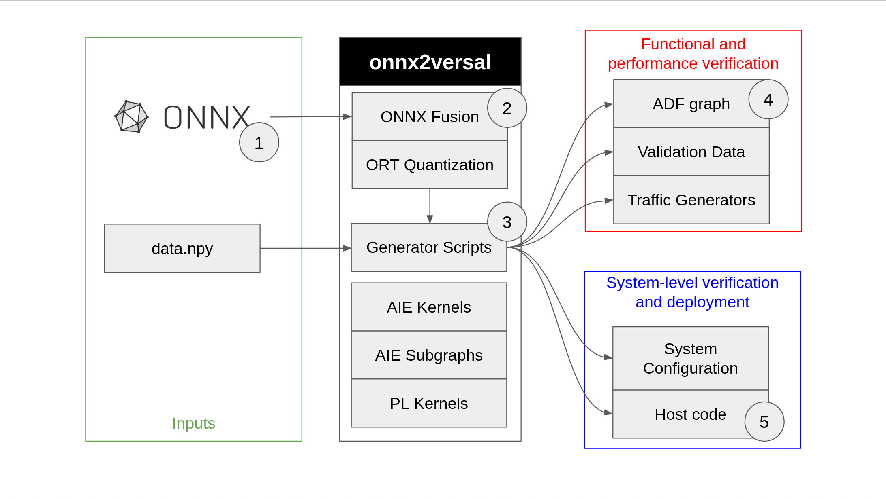

# onnx2versal

Presentation Slides: https://docs.google.com/presentation/d/1xq7Fp-YRgMAOc_wpQ1FjY7M9irCAVrBn46ohUy1YuEw/edit?usp=sharing
<br>
This covers an introduction to AI Engines, its architecture, onnx2versal and benchmark results on Tiny MLPerf.

## What are AI engines?
The AI engine is a part of Versal Adaptive Compute Acceleration Platform (ACAP) architecture, designed for high compute density, deterministic timing and high performance applications. It comprises of an **array of tiles that support Very Long Instruction Word (VLIW) parallelism, and SIMD fixed point and floating point processors**. Below are images taken from Xilinx docs showing tile components and interfaces.

<div align="center">


</div>
<br>

For more details
* Architecture documentation: https://docs.xilinx.com/r/en-US/am009-versal-ai-engine/Overview
* Main website: https://www.xilinx.com/products/technology/ai-engine.html
* White paper: https://www.xilinx.com/content/dam/xilinx/support/documents/white_papers/wp506-ai-engine.pdf


## What is onnx2versal?

This repo holds AIE kernels/graphs and generator scripts to create system level design for AI engines given `some_model.onnx` and `some_data.npy`. It is built on top of AI Engine ISA, AIE programming API and the ADF graph programming model. Verify, profile and run your ONNX models on AI engine machines!

<div align="center">

</div>

### TLDR CLI commands
```
GRAPH=tiny_kws

# Step 1: fuse
python fuse_onnx.py ../models/${GRAPH}.onnx ../models/${GRAPH}.onnx

# Step 2: quantize
python -m onnxruntime.quantization.preprocess --input ../models/${GRAPH}.onnx --output ../models/${GRAPH}_infer.onnx
python quantize_onnx.py ../models/${GRAPH}_infer.onnx ../models/${GRAPH}_int8.onnx ../data/$GRAPH/X_test.npy

# Step 3: generate
python generate.py ../models/${GRAPH}_int8.onnx ../data/$GRAPH/X_test.npy

# Step 4: Test latency
TARGET=hw_emu GRAPH=${GRAPH}_int8 make graph aiesim_profile

# Step 5: Test throughput
TARGET=hw_emu DOUT=0 DLOG=0 GRAPH=${GRAPH} make graph clean_reports aiesim ITER_CNT=2
python throughput.py reports_dir/$GRAPH/hw_emu/aiesimulator_output/k*

# Step 6: Build for hardware
TARGET=hw DOUT=0 DLOG=0 GRAPH=${GRAPH} make graph kernels xsa application package
```

## [Usage](docs/md/usage.md)

* See setup and how to run details at [docs/md/usage.md](docs/md/usage.md)
* See end to end example at [Lenet Example](docs/md/lenet_example.md). _TODO: this example has not been updated and tested for a while._
* See jupyter notebooks that run through the same examples at 
    * Conversion to Onnx [pytorch2onnx notebook](python/part1_pytorch2onnx.ipynb), [tf2onnx notebook](python/part1_tf2onnx.ipynb)
    * Onnx2Versal [onnx2versal notebook](python/part2_onnx2versal.ipynb) <br />


## [How good are the AI engines?](docs/md/profile.md)

* See details at [docs/md/profile.md](docs/md/profile.md)

The pipeline has been tested for Tiny MLPerf models. The models below are trained from hls4ml-finn repositories for direct comparison with hls4ml implementation. It has shown latency improvements of 5x (Keyword Spotting), 8x (Image Classifciation) and 18x (Anomaly Detection) under 11-15% utilization. For details on the hls4ml implementation see [Hls4ml MLPerf Tiny paper](https://cds.cern.ch/record/2826586/files/2206.11791.pdf).

|       Use Case         | Dtype            | Latency (cycles or ns) | Throughput (samples/s) | Resource Utilization (Kernels/Buffers/Stream/PLIO/GMIO) | Accuracy (first 1k) | Quality Target | Model 
|:----------------------:|:----------------:|:----------------------:|:----------------------:|:---------------------------------------:|:-------------------:|:----------------:|:-------------------:|
|   Keyword Spotting   | fp32 <br/> uint8 | 35076    <br/> 3159    | 75369   <br/> 1157407  | 46/56/116/5/24   <br/> 48/51/83/7/0      | 84.8% (Top 1)       | 82.5% (Top 1)    | [MLP](https://github.com/hls4ml-finn-mlperftiny/tiny_results_v0.7/blob/main/open/hls4ml-finn/code/kws/KWS-W3A3/training/model/models.py)
|   Anomaly Detection  | fp32 <br/> uint8 | 3165     <br/> 1014    | 3205128 <br/> 7142857  | 44/58/128/7/0    <br/> 46/48/76/2/0      | 0.830 (AUC)         | 0.83  (AUC)      | [AutoEncoder](https://github.com/hls4ml-finn-mlperftiny/tiny_results_v0.7/blob/main/open/hls4ml-finn/code/ad/AD08/training/keras_model.py)
| Image Classification | fp32 <br/> uint8 | 739274   <br/> 174992  | 4324    <br/> 22258    | 62/68/125/9/7    <br/> 90/95/144/2/5     | 84.1% (Top 1)       | 83.5% (Top 1)    | [CNN](https://github.com/hls4ml-finn-mlperftiny/tiny_results_v0.7/blob/main/open/hls4ml-finn/code/ic/RN07/training/resnet_v1_eembc.py)
* Latency is calculated based on cycle count from cycle-accurate aiesimulator through AI Engine programming logging API, specifically `aie::tile::current().cycles()`. Obtained through aiesimulator logs.
* Throughput is calculated based on output bandwidth over multiple iterations. Obtained by running `throughput.py` on aiesimulator output files and assumes AI engine is clocked at 1GHz.

## Issues

Below are certain issues that may arise from using the pipeline.
### Certain operations, input shapes or parameter sizes is not supported
1. Write a op. Files required: 
    - `design/aie_src/my_op.cc`
    - `design/aie_src/my_op.h`
    - `design/aie_src/graph_my_op.cpp`
    - `design/aie_src/graph_my_op.h`
2. Add data. Files required:
    - `data/my_op_in.txt`
    - `data/my_op_golden.txt`
3. Test it:
    - x86 Graph test: `TARGET=sw_emu GRAPH=my_op make clean_reports graph aiesim # X86 GRAPH`
    - SysC Graph test: `TARGET=hw_emu GRAPH=my_op make clean_reports graph aiesim # SYSC GRAPH`

### There are issues generating the ADF graph
1. See reference generated graph from example
2. See documentation for any dimension restrictions for kernels/graphs.
3. Write the high level ADF graph for the network


### Important documentation
* [AIE kernels and graphs used in this repo](https://rehohoho.github.io/onnx2versal/)
* [Vitis Tutorials - AI Engine Development](https://github.com/Xilinx/Vitis-Tutorials/tree/2022.1/AI_Engine_Development)
* [AI Engine Kernel and Graph Programming Guide (UG1079)](https://docs.xilinx.com/r/en-US/ug1079-ai-engine-kernel-coding/)
* [AI Engine Documentation - AIE API or Intrinsic guide](https://www.xilinx.com/htmldocs/aiengine_intrinsics_start.html)
* [AI Engine Tools and Flows User Guide (UG1076)](https://docs.xilinx.com/r/en-US/ug1076-ai-engine-environment/)
* [Vitis HLS](https://docs.xilinx.com/r/en-US/ug1399-vitis-hls)
* [XRT Documentation - Host application programming docs](https://xilinx.github.io/XRT/master/html/index.html)
* [XRT AIE API - xrt_aie.h](https://github.com/Xilinx/XRT/blob/master/src/runtime_src/core/include/experimental/xrt_aie.h)
